# BigQuery Release Notes Explorer 🚀

A premium, interactive web application that fetches, parses, caches, and visualizes the official Google Cloud BigQuery Release Notes feed in a gorgeous modern dashboard. Built with a Python Flask backend and a vanilla HTML5, CSS3, and JavaScript frontend.

---

## ✨ Features

*   **Timeline Segmentation**: Parses consolidated multi-update dates from the Atom feed into clean, individual, itemized release cards.
*   **Dual-Layer Caching**:
    *   *In-Memory Cache*: Keeps pages loading instantly and prevents feed rate-limiting (10-minute expiry).
    *   *Persistent File Cache (`cache.xml`)*: Prevents app crashes by automatically falling back to cached files when offline or when Google Cloud's servers are unreachable.
*   **Dashboard Metrics**: Real-time counter widgets for Total Notes, Features, Issues, and Breaking Changes.
*   **Advanced Filtering & Search**:
    *   *Search as you type*: Matches text in the title, category, date, or descriptions instantly.
    *   *Category Filter Pills*: Color-coded buttons to toggle Feature, Issue, Change, Breaking, and Announcement categories.
    *   *Timeframe Presets*: Quick filters for Last 30 Days, 90 Days, 180 Days, 1 Year, or All Time.
    *   *Sort Direction*: Toggle between Newest First and Oldest First.
*   **User Personalization**:
    *   *Bookmarks*: Persistently save critical release notes locally (`localStorage`).
    *   *Link Copying*: Easy-to-use clipboard copy button for direct reference links.
    *   *X (Twitter) Sharing*: Instantly tweet a summary of any note with automated truncation and hashtags via official Web Intents.
*   **Aesthetic Responsive Layout**: Premium dark/light themes with glowing background gradients, glassmorphism, skeletons, and responsive typography that looks great on mobile, tablet, and desktop.

---

## 📁 Project Structure

```text
bq-release-notes/
├── app.py              # Flask server, feed parsing logic & cache controller
├── cache.xml           # Local fallback file cache (auto-generated)
├── templates/
│   └── index.html      # semantic HTML dashboard template
└── static/
    ├── css/
    │   └── style.css   # Color tokens, glassmorphic styling & keyframe animations
    └── js/
        └── app.js      # Frontend state-machine, filtering logic & events
```

---

## 🏛️ Architecture & Data Flow

### 1. Server-Side (Python Flask)
The backend in `app.py` acts as an API proxy and resilient cache manager:
*   **XML Parsing**: Uses `xml.etree.ElementTree` to load the Atom XML feed, and splits consolidated multi-update dates into individual entries by locating HTML `<h3>` tags with a regular expression.
*   **Tiered Cache**: Stores feed data in memory for 10 minutes. If the memory cache is expired, it fetches the live feed and updates the local persistent backup file `cache.xml`. If the live fetch fails due to connectivity issues, it automatically falls back to reading `cache.xml`.

### 2. Client-Side (Vanilla JS/CSS/HTML)
The frontend builds a stateful dashboard using pure web technologies:
*   **State Control**: `static/js/app.js` holds a single state tree tracking raw notes, user-selected filters, search text, active categories, bookmarks, and sort directions.
*   **Premium Styles**: `static/css/style.css` manages fluid theme states, layout components, skeletons, responsive designs, and timeline connectors.

### 🔄 Request-Response Sequence (Sync Flow)

```mermaid
sequenceDiagram
    autonumber
    actor User
    participant Browser as Client (app.js)
    participant Flask as Backend (app.py)
    participant Google as Google Cloud Feed

    User->>Browser: Clicks "Sync Live"
    Note over Browser: 1. Disables button & starts infinite spin<br/>2. Renders skeleton loading cards
    Browser->>Flask: HTTP GET /api/notes?force=true
    
    rect rgb(30, 41, 59)
        Note over Flask: 3. 'force=true' bypasses cache<br/>4. Requests live XML feed
        Flask->>Google: GET /feeds/bigquery-release-notes.xml
        Google-->>Flask: Returns Atom XML (200 OK)
        Note over Flask: 5. Saves raw XML to cache.xml<br/>6. Splits & parses entries in Python
        Flask-->>Browser: Returns JSON representation (200 OK)
    end

    Note over Browser: 7. Receives notes JSON<br/>8. Computes and updates metrics<br/>9. Runs filters & formats HTML timeline cards
    Note over Browser: 10. Stops spinner & enables button<br/>11. Triggers "Feed synchronized!" toast
    Browser->>User: Displays fully populated interactive timeline
```



---

## 🚀 Getting Started

### Prerequisites
*   Python 3.8 or higher
*   Pip (Python package manager)

### Installation

1.  Navigate into the directory:
    ```bash
    cd bq-release-notes
    ```

2.  Install required packages:
    ```bash
    pip install flask requests
    ```

### Running the App

Start the development server:
```bash
python app.py
```

Open your browser and navigate to:
```text
http://127.0.0.1:5000
```

---

## 🔌 API Documentation

### `GET /api/notes`
Fetches and returns the parsed release notes feed.
*   **Query Parameters**:
    *   `force` (boolean, optional): Set to `true` to bypass the cache and force a sync with Google Cloud.
*   **Response Format**:
    ```json
    {
      "status": "success",
      "source": "fresh", // "fresh", "file_cache", or "error"
      "last_updated": "2026-06-16 19:10:49",
      "total_items": 68,
      "stats": {
        "Feature": 52,
        "Issue": 2,
        "Breaking": 3,
        "Change": 4,
        "Announcement": 7
      },
      "notes": [
        {
          "id": "tag:google.com,2016:bigquery-release-notes#June_15_2026_0",
          "date": "June 15, 2026",
          "raw_date": "2026-06-15T00:00:00-07:00",
          "category": "Feature",
          "content": "<p>Use Gemini Cloud Assist to...</p>",
          "link": "https://docs.cloud.google.com/bigquery/docs/release-notes#June_15_2026"
        }
      ]
    }
    ```

### `POST /api/refresh`
Forces an immediate background fetch to synchronize with Google Cloud and updates the local persistent cache.
*   **Response Format**:
    ```json
    {
      "status": "success",
      "source": "fresh",
      "last_updated": "2026-06-16 19:10:49",
      "total_items": 68
    }
    ```
