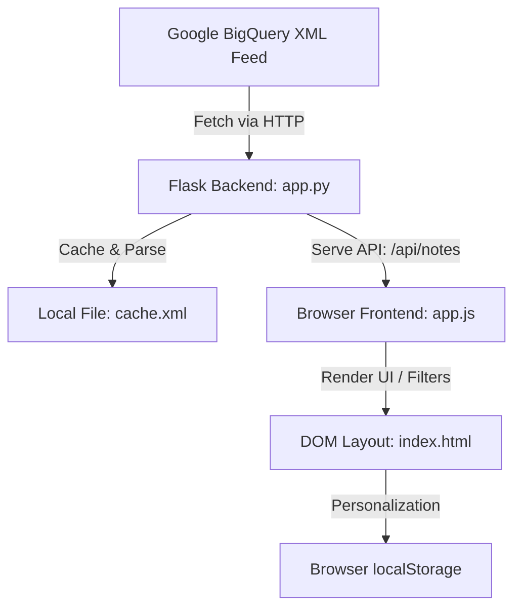

# BigQuery Release Notes Explorer - Implementation Plan

This document outlines the architectural decisions, design patterns, and phase-by-phase implementation details followed to build the BigQuery Release Notes Explorer web application.

---

## 🏗️ Architectural Overview

The application utilizes a lightweight, resilient client-server model:

---

## 🛠️ Phase-by-Phase Implementation Plan

### Phase 1: Feed Verification & Parsing Strategy
1.  **Source Verification**: Fetch and verify the structure of `https://docs.cloud.google.com/feeds/bigquery-release-notes.xml`.
2.  **Granular Segmentation**: Rather than displaying whole consolidated entries, split the HTML CDATA content by `<h3>` header tags to identify individual, card-sized updates (Features, Changes, Issues, Breaking, Announcements).
3.  **Parsing Pattern**: Use a regex-based parser to extract each category-content block along with its parent entry date and URL:
    `re.compile(r'<h3>(.*?)</h3>(.*?)(?=<h3>|$)', re.DOTALL)`

### Phase 2: Backend Resiliency & Caching
1.  **Double-Tier Cache**:
    *   **Tier 1 (In-Memory)**: Stores parsed JSON list for up to 10 minutes to minimize network overhead and page load latency.
    *   **Tier 2 (File Cache `cache.xml`)**: Serves as a persistent offline backup. If the app loses internet connection or Google's feed is down, it reads from the file.
2.  **Endpoints**:
    *   `GET /`: Serves the primary dashboard template.
    *   `GET /api/notes`: Returns parsed feed elements and metrics counts. Supports `force=true` parameter.
    *   `POST /api/refresh`: Forces synchronization and updates both cache tiers.

### Phase 3: UI Layout & Premium Design System
1.  **CSS Tokens**: Define variable sets for background glows, glassmorphism, responsive typography, and distinct category colors (Emerald for Features, Orange for Issues, Crimson for Breaking, Purple for Changes).
2.  **Semantic HTML Structure**: Create a sticky sidebar for controls/filters on the left, a timeline feed area on the right, and a statistics grid dashboard on the top header.
3.  **Responsive Layout**: Use CSS grid/flexbox with media queries to ensure smooth stacking on mobile viewports.
4.  **Animations**: Include pulsing skeleton cards for loader states and hover transitions on action elements.

### Phase 4: Frontend State-Machine (`app.js`)
1.  **State Representation**: Store list data, bookmarks, active filters (search term, categories, timeframe), and sort direction in a global state object.
2.  **Interactive Functions**:
    *   *Real-time Filter*: Match search queries as the user types across date, category, and text description.
    *   *Local Storage Bookmarks*: Allow saving release notes, preserving IDs inside the user's browser `localStorage`.
    *   *Direct Clipboard Copy*: Quick-copy URL anchors of individual Google release items.
    *   *X/Twitter Integration*: Parse, clean HTML text, truncate to fit 280-char limits safely, append `#BigQuery #GoogleCloud` hashtags, and trigger the official share intent popup.

### Phase 5: Verification & Quality Assurance
1.  **Syntax Checks**: Compile python scripts (`py_compile`) to verify imports and syntax.
2.  **DevTools Visual Verification**: Start local server, navigate to `http://127.0.0.1:5000/`, verify visual assets, test light/dark theme toggles, and sync buttons.
